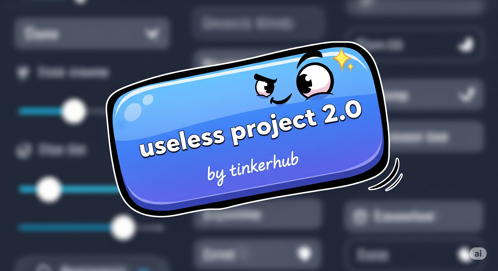

# A "NORMAL" BUTTON



_Just your everyday, totally normal, absolutely not suspicious button. Nothing to see here, move along..._

## Basic Details

### Team Name: Team Obsolete

### Team Members

- Wesly Philip Jacob - College of Engineering Poonjar

### Project Description

A completely normal button that definitely won't run away from your cursor, transform into a modern calculator, or glitch into alternate dimensions. It's just a button. Really. Trust us.

### The Problem (that doesn't exist)

Buttons these days are too predictable. They just sit there, waiting to be clicked, doing exactly what they're told. Where's the excitement? Where's the mystery? Where's the borderline psychological warfare?

### The Solution (that nobody asked for)

We've created a button with personality disorders, trust issues, and a tendency to glitch into alternate dimensions. It's not just a button, it's an experience - one that your therapist will hear all about.

## Technical Details

### Technologies Used

- **React 18** (for giving buttons existential crises)
- **Anime.js** (for smooth animations and transitions)
- **CSS3** (for modern styling and effects)
- **JavaScript ES6+** (for implementing chaos theory)
- **Your Sanity** (as a testing framework)

### Key Features

- **Three Random Events**: Each click triggers one of three unique experiences
- **Modern Calculator UI**: Complete with light/dark mode support
- **Destructive Glitch Effects**: Visual chaos with aggressive animations
- **Viewport-Constrained Runaway**: Button movement stays within screen bounds
- **Responsive Design**: Works on desktop and mobile devices

## Installation

```bash
# Clone this repository (if you dare)
git clone https://github.com/Dezuze/useless_project_temp.git

# Enter the danger zone
cd useless_project_temp

# Install dependencies (and questionable life choices)
npm install

# Start the chaos
npm start

# Build for production (if you're brave enough)
npm run build
```

## Usage Instructions

1. Click the "Click Me" button
2. Experience one of three random events:
   - **Calculator Mode**: A fully functional useless calculator
   - **Runaway Button**: Chase the button around your screen
   - **Glitch Attack**: Watch reality break down
3. Try to maintain your sanity
4. Repeat until you question your life choices

## Features (or Symptoms)

### 🧮 Calculator Mode

- **Modern Interface**: Sleek calculator with iOS-style design
- **Light/Dark Theme**: Automatically adapts to your app's theme
- **Useless Results**: Generates hilariously wrong answers
- **No Time Limit**: Calculator stays open until you exit
- **Smart Button Logic**: Calculate button only appears after entering numbers

### 🏃‍♂️ Runaway Button

- **Intelligent Evasion**: Button actively avoids your cursor
- **Viewport Constrained**: Won't escape your screen
- **Smooth Animations**: Powered by Anime.js
- **8-Second Duration**: Just long enough to be frustrating

### 💥 Glitch Attack

- **Destructive Effects**: Violent shaking, color distortion, and strobing
- **Multiple Animations**: Simultaneous chaos for maximum impact
- **5-Second Experience**: Brief but memorable
- **No Auto-Trigger**: Only happens when you click (no random annoyance)

### 🎨 Additional Features

- **Dark Mode Support**: Button adapts to your theme preference
- **Smooth Transitions**: Professional animations throughout
- **Clean Code**: ESLint compliant and well-documented
- **Mobile Friendly**: Responsive design works on all devices

## Event System

The button randomly selects one of three events on each click:

1. **Calculator Mode** (33% chance)

   - Opens modern calculator interface
   - Generates humorous "calculations"
   - Manual exit required

2. **Runaway Mode** (33% chance)

   - Button flees from cursor
   - Viewport-constrained movement
   - Auto-returns after 8 seconds

3. **Glitch Attack** (33% chance)
   - Aggressive visual effects
   - Multiple simultaneous animations
   - 5-second chaos experience

## Known "Features"

- Button may develop trust issues
- Calculator might fail basic math (intentionally)
- Your cursor's self-esteem might take a hit
- Side effects may include laughter and existential dread
- No buttons were harmed in the making of this project

## Development Commands

```bash
# Start development server
npm start

# Run linting
npm run lint

# Fix linting issues automatically
npm run lint:fix

# Build for production
npm run build

# Run tests
npm test
```

## Browser Support

- Chrome (recommended)
- Firefox
- Safari
- Edge
- Any modern browser with ES6+ support

## Team Contributions

**Wesly Philip Jacob**:

- Button Behavior Specialist
- Modern Calculator Designer
- Glitch Effect Master
- Chaos Implementation Lead
- Animation Engineer
- Viewport Constraint Architect

## Project Architecture

```
src/
├── AnimatedButton.js     # Main component with all button logic
├── AnimatedButton.css    # Styles for button and calculator
├── App.js               # Main app with dark mode toggle
├── App.css              # Global app styles
├── DarkModeToggle.js    # Theme switcher component
└── BackwardsClock.js    # Bonus backwards clock feature
```

## Disclaimer

No buttons were harmed in the making of this project. They're just having an identity crisis. Side effects may include uncontrollable laughter, questioning reality, and an urge to click things that shouldn't be clicked.

---

Made with questionable decisions and excessive caffeine by **Team Obsolete** at TinkerHub Useless Projects 🚀
